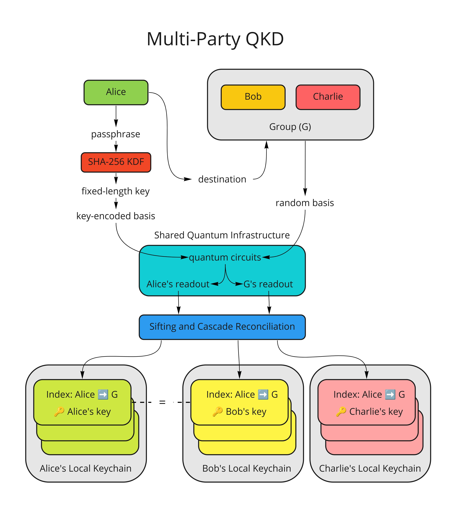
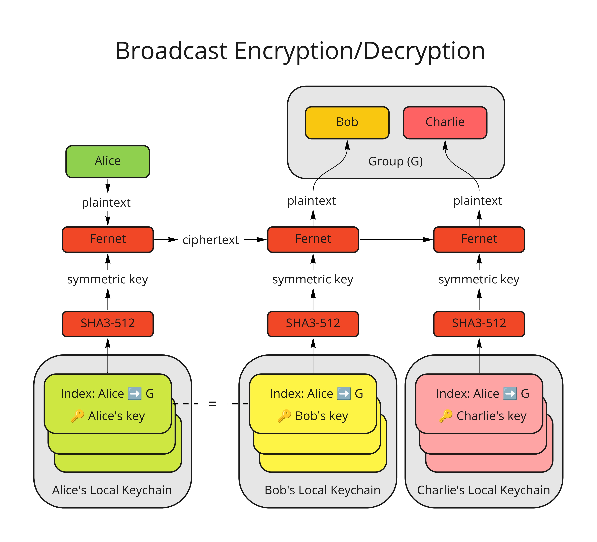

# QUACKD-Bot: Slackbot-Powered Multi-Party Cryptography with B92 QKD Protocol

## Introduction

The development of quantum algorithms has simultaneously opened up avenues to break classical cryptographic codes and create new, powerful encryption schemes through the development of inherently quantum codes. This presents both a danger to existing encryption schemes and an opportunity to safeguard information to a much greater extent than previously possible.

In this project, we create a Slackbot interface that generates quantum keys to encrypt Slack communications, both between individual users and in multi-user channels, through the B92 protocol. Our high-level interface allows users to initiate key generation from a set of simple and intuitive commands, and send separately encrypted messages to multiple users simultaneously.

## Team Members

Jessie Chen, Nikhil Harle, Richard Li, Allen Mi, Will Sun (Yale University)

## How-To-Run

The project is developed under `x86-64` Linux. The system dependencies are as follows:

- `conda`: Anaconda or Miniconda, for managing the appropriate Python virtual environment

To install the Python dependencies, run
```
conda env create -f requirements.yml
```
at the root directory of the folder, followed by
```
conda activate quackd
```
to activate the virtual environment.

To populate the relevant credentials, navigate to the `credentials/` directory and make a copy of the template JSON files. Rename the copies `ibm.json` `qi.json` and `slack.json` respectively. Modify the files with your own credentials.

To run QUACKD-Bot, invoke `run_app.sh` in the root directory. The file contains instructions for performing B92 on various simulator and hardware backends.

### Project structure

- `credentials/`: Templates for credential storage for various services
- `figures`: Project figures
- `noise-rb/`: Code and data for performing noise characterization via randomized benchmarking (RB)
- `qkd-b92/`: Tutorials that detail B92 and postprocessing steps used for our QKD implementation
- `quackd/`: Source code for QUACKD-Bot
  - `app.py`: Websocket interface to Slack API
  - `b92.py`: Implementation of the B92 protocol, along with cascade reconciliation scheme
  - `crypto.py`: Code for symmetric-key encryption and decryption, and key/checksum generation
  - `globals.py`: Global variables
  - `keychain.py`: Implementation of local, per-user keychains
  - `progress.py`: Progress bar for Slack chat
  - `utils.py`: Various utility code
- `README.md`: this Markdown file
- `requirements.yml`: `conda` virtual environment specifications
- `run_app.sh`: Main entry point of the program

## Technical Overview

**Slackbot interface** allows users to send and receive quantum keys generated via the B92 Protocol, encrypt messages, and send to individuals or groups.

**Randomized benchmarking** examines characteristics of the qubit-specific noise channels, including crosstalk between qubits. It provides empirical guarantees for parallel QKD schemes on adjacent qubits.

**Measurement error mitigation** combats quantum readout noise.

**Information reconciliation** through the **cascade** protocol, **privacy amplification**, and **randomness extraction** guarantees key effectiveness and security.

### QKD and Reconciliation Toolflow



### Encryption and Decryption Toolflow




## Simple Video Demos
- Sending a key to a person!


- Sending a key to a group!


- Checking your own keychain!


For other commands such as sending an encrypted message, viewing a message, and choosing a backend, please check how to view these instructions in the "How-To-Run" section.

## Other Examples and Functionality

- `qkd-b92/B92_Circuit_Hardware.ipynb` contains some examples which were not ultimately included in the Slackbot functionality, yet are of general or educational interest. For example, it contains:
  - An image which is successfully encrypted and decrypted using a distributed key that is repeated many times!
  - Example experiments demonstrating how the measurement error calibration matrices are formed on `Starmon-5` and `Spin-2` backends, as well as the creation of reconciled keys
  - Details on how the counts threshold for a given results dictionary determines Bob’s bit values

## Personal Experiences

This was a really enjoyable and rewarding experience. We enjoyed the opportunity to reinforce our theoretical knowledge of QKD protocols by running B92 on actual quantum hardware, as well as the chance to practice characterizing errors on individual qubits and implementing complementary error correction protocols. We would like to thank the QuTech mentors for their dedication to helping participants through difficult portions of the challenge and making advice public on the Slack. Additionally, we would like to thank the iQuHACK team for their excellent organization and for making this event happen.

## Sources

### B92 Protocol

Bennett, C. H. (1992). Quantum cryptography using any two nonorthogonal states. Physical Review Letters, 68(21), 3121–3124. https://doi.org/10.1103/physrevlett.68.3121

Haitjema, M. (2007). A survey of the prominent quantum key distribution protocols. Quantum Key Distribution - QKD. Retrieved January 30, 2022, from https://www.cse.wustl.edu/~jain/cse571-07/ftp/quantum/

### Measurement Error Mitigation

Jattana, M. S., Jin, F., De Raedt, H., & Michielsen, K. (2020). General error mitigation for quantum circuits. Quantum Information Processing, 19(11), 1-17.

Barron, G. S., & Wood, C. J. (2020). Measurement error mitigation for variational quantum algorithms. arXiv preprint arXiv:2010.08520.

### Classical Post-Processing and Information Reconciliation

B. R. (2021, April 28). A cascade information reconciliation tutorial. Hiking and Coding. Retrieved January 30, 2022, from https://hikingandcoding.wordpress.com/2020/01/15/a-cascade-information-reconciliation-tutorial/

### Randomized Benchmarking

Magesan, E., Gambetta, J. M., & Emerson, J. (2012). Characterizing quantum gates via randomized benchmarking. Physical Review A, 85(4), 042311.

## Date

January 30th, 2022
